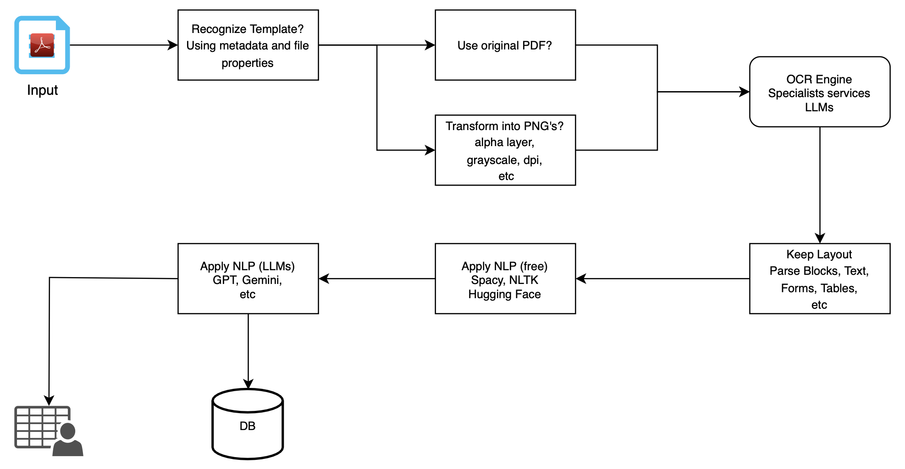
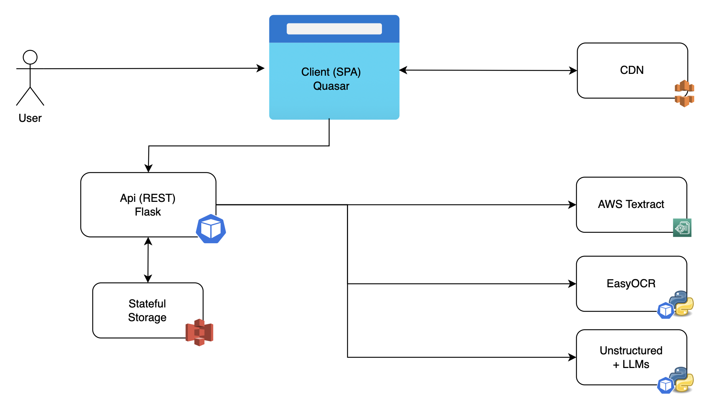

# TLab Technical Challenge

## Data Extraction from Documents

### Objective
Develop an application that extracts data from PDF documents and converts it into an editable format (e.g., CSV).

---

## User Journey
1. **File Upload**:  
   The user uploads a PDF file (example attached).
   
2. **Information Extraction**:  
   The application extracts information from the PDF and displays it in a front-end interface where the user can validate and correct the extracted data.
   
3. **Data Export**:  
   The validated information is saved in an editable file (e.g., CSV) that can be downloaded from the front-end.

---

## Deliverables

### 1. Analysis Report
#### Workflow for Document Information Extraction:
- **Image Acquisition**: Obtain the document (PDF).
- **Preprocessing**: Prepare the image for recognition.
- **Character Recognition (OCR)**: Extract textual data.
- **Postprocessing**: Refine the output for accuracy and usability.

#### Solutions Evaluated:
1. **Amazon Textract**:
   - **Features**: Excels at extracting tabular and form data.
   - **Value Proposition**: Offers the best balance of features and price among specialist services.

2. **EasyOCR**:
   - **Type**: Open-source and free.
   - **Performance**: Comparable to some paid OCR tools.
   - **Highlights**: Allows training expert models using templates.

3. **Unstructured Library**:
   - **Integration**: Works with paid LLMs for post-processing (NLP).
   - **Use Case**: Fine-tunes OCR extraction outputs.

#### Recommendation:
A pipeline combining these tools is suggested for a scalable and efficient document information extraction process.



---

### 2. Source Code
#### Overview
The application architecture simulates a scalable and independent environment, utilizing Kubernetes automation via [garden.io](https://garden.io).

#### Modules:
1. **API**: Handles backend operations and data processing.
2. **Client**: Provides a user-friendly front-end interface.

#### Scalability:
- Designed for horizontal and vertical scaling using autoscaling pods to optimize resource allocation and maintain high performance.

---

### 3. Configuration Instructions
To run the application locally:

1. **Generate AWS Textract Credentials**:  
   Obtain credentials with access permissions to AWS Textract.

2. **Set Environment Variables**:  
   Use the generated credentials to configure the environment variables.

3. **Run the Client Module**:
   ```bash
    cd demo-ocr/client
    npm install
    export API_URL=http://127.0.0.1:5000
    npx quasar dev
    ```

4. **Run the Api Module**:
    ```bash
    pip install -r requirements.txt
    export AWS_DEFAULT_REGION=eu-west-1
    export AWS_ACCESS_KEY_ID=your_aws_access_key_id
    export AWS_SECRET_ACCESS_KEY=your_aws_secret_access_key
    python src/service.py
    ```

---

### 4. Deployment Proposal

It is important to consider deeper aspects of the solution’s value delivery, such as the target audience, devices, and access volume, when designing an architecture. This project was designed as a demo and to facilitate experimentation. It consists of two primary modules:  

1. **Frontend (Client)**:  
   Built using the Quasar framework (Vue.js), allowing the application to be easily exported as a:
   - Single Page Application (SPA)
   - Progressive Web Application (PWA)
   - Mobile application
   - Desktop application  

2. **Backend (API)**:  
   Handles business logic and data extraction tasks.  

#### Modularization for Scalability
Depending on the solution's delivery alignment and value capture requirements, the **API module** could be further divided into two microservices:  
- **Textract Service**: Dedicated to handling tasks using Amazon Textract.  
- **EasyOCR Service**: Focused on EasyOCR-based processing with a stateful file repository for managing document storage.  

#### Proposed Deployment Plan
1. **Frontend Deployment**:  
   - Deploy the **client module** as a **Single Page Application (SPA)** using a cloud provider's CDN (e.g., AWS S3, Google Cloud Storage, Azure Blob Storage) for fast and scalable delivery.

2. **Backend Deployment**:  
   - Deploy the **API module** in a Kubernetes-based infrastructure orchestrator such as:
     - AWS Elastic Kubernetes Service (EKS)
     - Google Kubernetes Engine (GKE)
     - Azure Kubernetes Service (AKS)
   - Use a stateful filesystem (e.g., shared disk or S3 bucket) for file storage.

3. **CI/CD Automation**:  
   - Implement **GitHub Actions** to automate Continuous Integration/Continuous Deployment (CI/CD) routines:
     - Testing
     - Building
     - Deploying both the frontend and backend modules.

---

This deployment proposal ensures a robust, scalable, and adaptable architecture for the document information extraction solution, catering to both experimentation and production-level implementations.

---

### 5. Relevant Documentation: Any other relevant documentation (e.g., HLD)



---

### 6. Extracted Data File: File with the extracted data

[Document Data Extraction Workflow](assets/extracted.csv "download")

---

### 7. Live Demonstration: Live demonstration of the solution

Any questions? Let me know. :)
